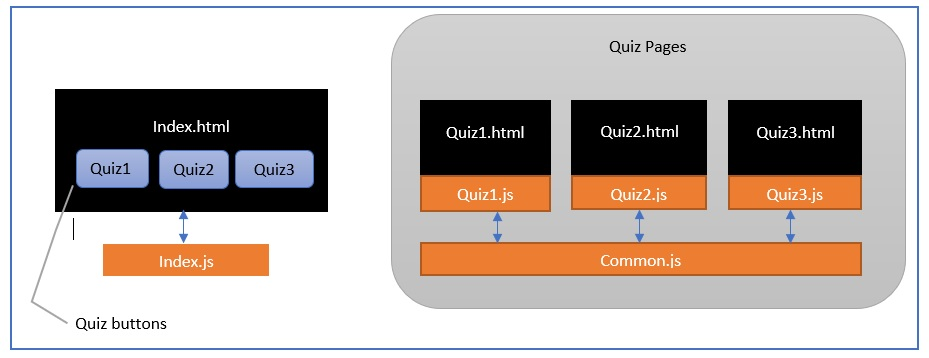
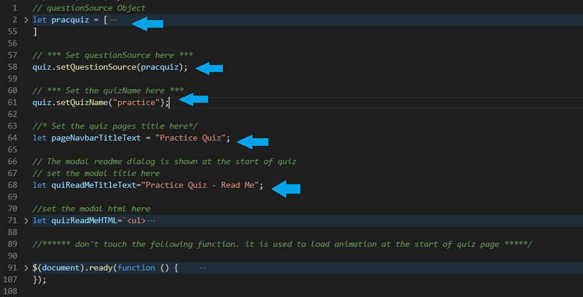

# codequiz

# Description
Code Quiz is a user friendly and developer friendly Quizzing application.

**User Friendly** : because , user just have to select options. User can store scores and compare overall performance.

**Developer Friendly** : *Code Quiz*. Referred as CQ hence after is developer friendly application. Developer can easily add new quizzes or even change the question sources without even touching the HTML. CQ is completely JavaScript based application and uses JSON syntax for creating quiz question sources.

  

# Demo for Users

  

# Author and Deployment Details

| 1 | GitHub Repo  | https://github.com/bhagatabhijeet/codequiz |
| ------------- | ------------- | ------------- |

| 2 | Git Hub Pages  | https://bhagatabhijeet.github.io/codequiz/index.html |
| ------------- | ------------- | ------------- |

## Highlights

* The **CQ** quizzes follow a consistent bootstrap controls and color theme.
* I have not cluttered too many images in the pages thus making it a professional portfolio.
* Super easy for developers to add new quizzes. *see for developer* section below.

# For developers who want to build their own quizzes.

## forking the repo
 and submitting a pull request is highly recommended.

## Architecture Overview

Refer to the diagram below

* CQ uses separate JS file for each quiz.
* There is *nothing special* about the quiz.html
  * The quiz.html file just serves as template and holder for the corresponding <Quiz.js> file.
* The **main quizzing logic** and **UI logic** is all in **common.js**
* In that sense common.js is the main engine of CQ.
* The quiz specfic js is *merely a source of questions* for any specific quiz. 

## Third party API Libraries

* jQuery 3.5.1
* Bootstrap 4.5
* Font Awesome

## The quiz question source
* The quiz specific JS file expects question source as following JSON

<pre>
<code>
// questionSource Object
    let pracquiz = [
    {
      num: 1,
      q: "Your Question Text Goes Here",
      options: [
        { id: 1, optiontext: "Your Option 1" },
        { id: 2, optiontext: "Your Option 2" },
        { id: 3, optiontext: "Your Option 3" }
        // You may add as many options as you like
      ],
      correctOption: 3,
      // difficulty should be easy, medium or hard
      difficulty: "easy",
      // category is freeform
      category: "Math"
    }
  ]    
</code>
</pre>

## Function calls inside quiz specific JS

### Notes :
    * Do not modify the quiz html files.
    * The quiz html files although is just a template,but serves as an interface which has predefined controls for the quiz to work.
    * if you need to modify the modal ReadMe body, title and its html contents - make use of the quiz specific JS file. see the image "function calls inside quiz specific JS" above.

### Scores and rules
* currently the scoring rules and time subtraction rules are built in however long term the goal is to make them config driven.

### common.js
* common.js is the main driving engine for CQ
* common.js makes use of 'quiz' object to store quiz stats and time.
* quizTimer is the main timer for quiz.
* All answer options buttons, question divs etc are built dynamically using the functions in common.js
* Almost all important constructs in common.js have *documentation comment* above it. Please read the code and comments.
* Developers in case of enhancement request please create a GitHub issue or create a new pull request.

# Future
* more Quizzes to be added.
* Currently the question source object is a JavaScript object created in quiz specific JS. The long term goal is to make quiz source as separate stringified JSON file.
* Currently the scores are stored locally using **localStorage** object. The long term goal is to make the scores persist in some database.
